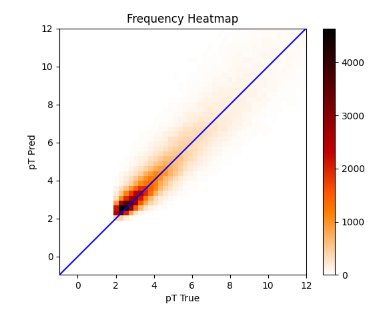
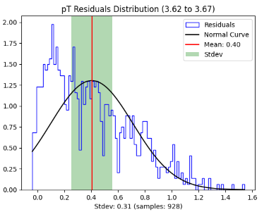

We noticed and came up with these observations:

1) Instead of taking eachStation as a node or each feature as a node, its better to take only the bendingAngle for each station to be the node feature. This reduces the number of parameters in the model.

2) Talking about the Edge feature we introduced the 3 dimensional vector feature. Which includes sin(phi), cos(phi), and eta (-log(tan(theta/2)))

3) Using these node and edge features we came up with a message passign layers with different number of hidden layers to fit the data and we see the results in the results section.

## Model

    MODEL_GNN(
    (conv1): MPL()
    (conv2): MPL()
    (conv3): MPL()
    (conv4): MPL()
    (lin1): Linear(in_features=28, out_features=22, bias=True)
    (lin2): Linear(in_features=22, out_features=16, bias=True)
    (lin3): Linear(in_features=16, out_features=16, bias=True)
    (lin4): Linear(in_features=16, out_features=1, bias=True)
    (global_att_pool1): GlobalAttention(gate_nn=Sequential(
        (0): Linear(in_features=12, out_features=1, bias=True)
    ), nn=None)
    (global_att_pool2): GlobalAttention(gate_nn=Sequential(
        (0): Linear(in_features=16, out_features=1, bias=True)
    ), nn=None)
    )

Number of learnable parameters: 5579

## Results

MAE: 0.941620

MSE: 2.312492

Average inference time: 515.472  microseconds

